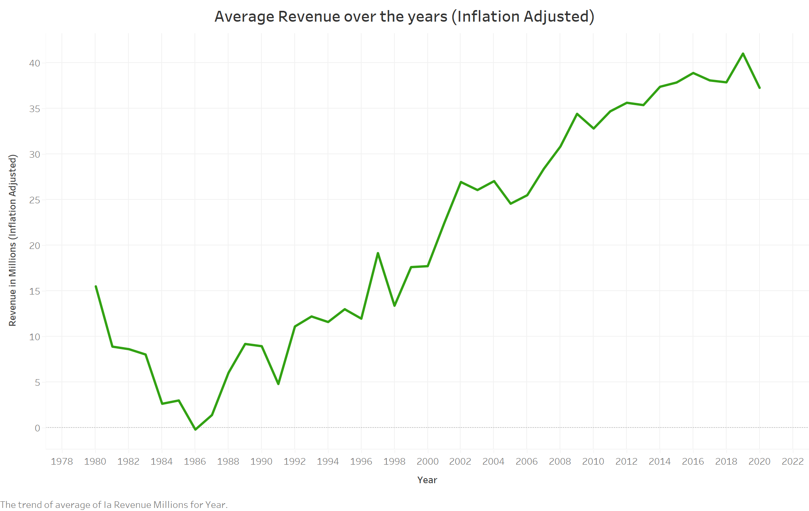
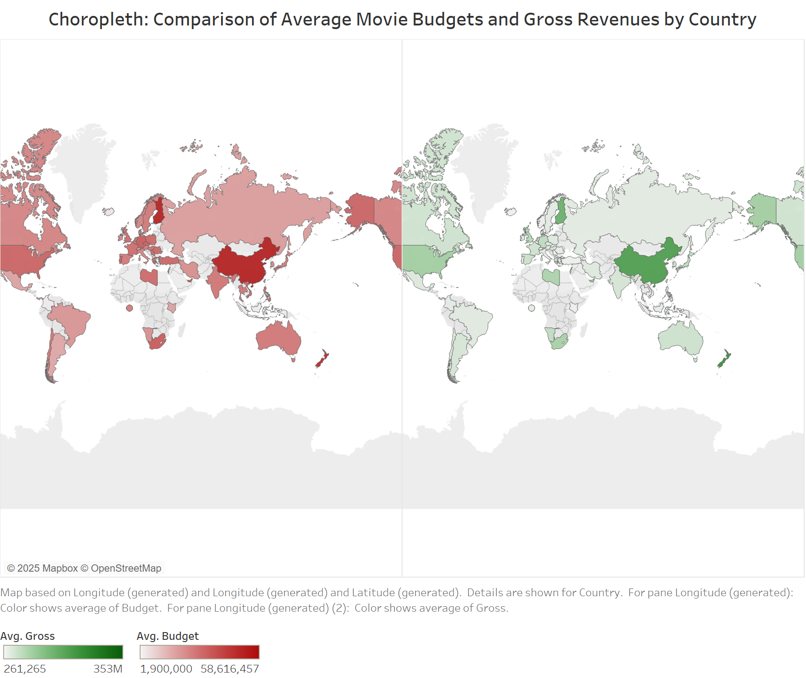
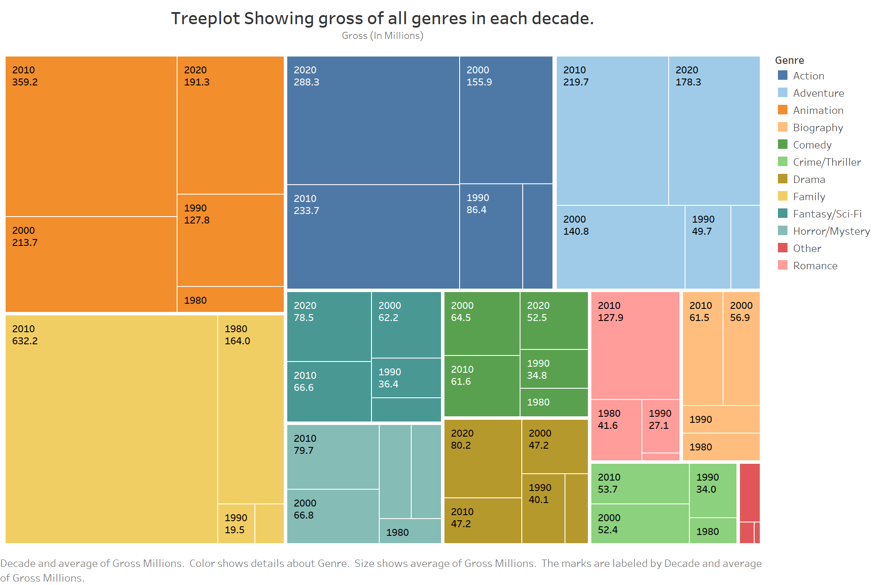
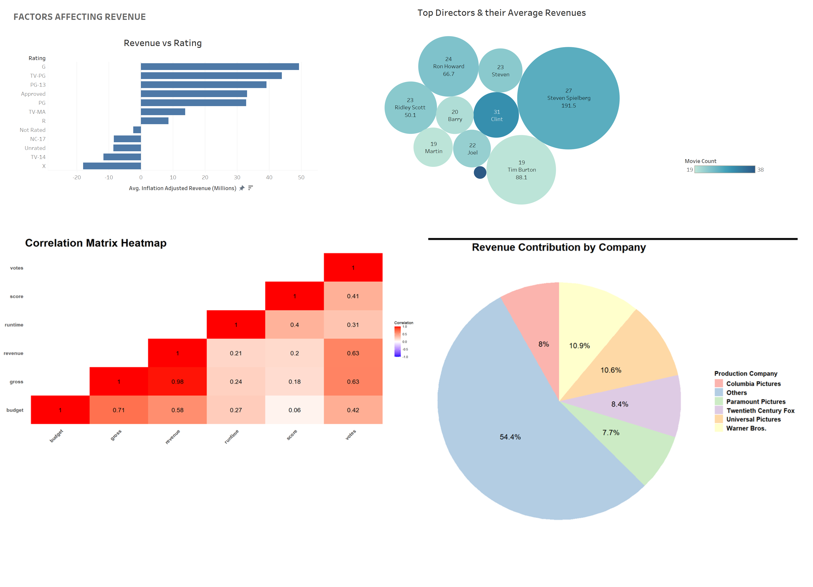

# 🎬 Movie Industry Data Analysis

**Data Visualization**
---

## 📌 Project Objective

This project explores global movie trends across 40+ years using data visualization. 
Our team analyzed how key factors—like genre, runtime, country, budget, and IMDb scores—impact box office performance. 
The goal is to tell a data-driven story about what makes a movie succeed financially and critically.

---

## 🧰 Tech Stack

- **R**: Data cleaning, preprocessing, and plot generation  
- **Tableau**: Advanced interactive dashboards and choropleth maps  
- **Libraries**: `ggplot2`, `dplyr`, `ggridges`, `treemapify`, `reshape2`, `RColorBrewer`

---
## 📊 Key Visualizations

### ▶️ Runtime vs Revenue (Line Plot)

> Shows average inflation-adjusted revenue for movies of different lengths. Runtime sweet spot appears around 120–130 minutes.

---

### 🌍 Choropleth: Avg Budget & Gross by Country

> Two side-by-side maps comparing average movie budgets (red scale) and gross revenue (green scale) across countries.

---

### 🌳 Tree Map: Genre + Gross by Decade

> Visualizes how different genres performed across decades, highlighting unexpected financial successes like the Family and Animation genres.

---

### 📊 Full Tableau Dashboard

> An interactive Tableau dashboard combining multiple plots and filters to explore key insights in one place.

---

## 🔮 Future Work

- Add interactivity to R plots (e.g., via Shiny)  
- Analyze actor/director influence on revenue  
- Build predictive models for box office success  
- Analyze award-winning vs underrated movies

---
